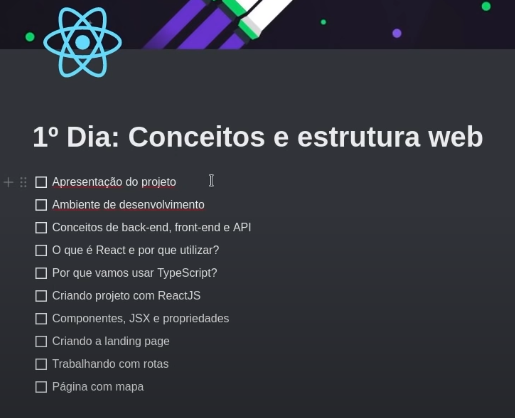
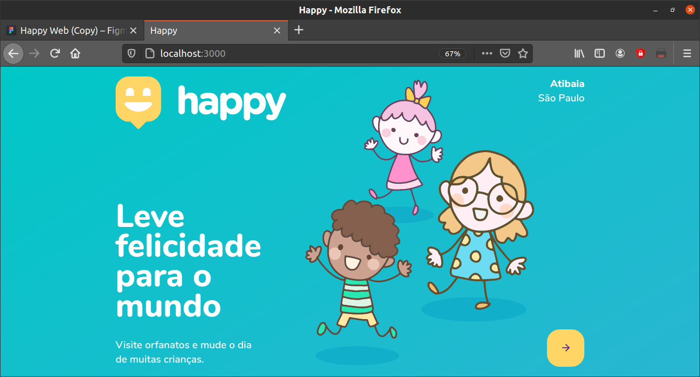
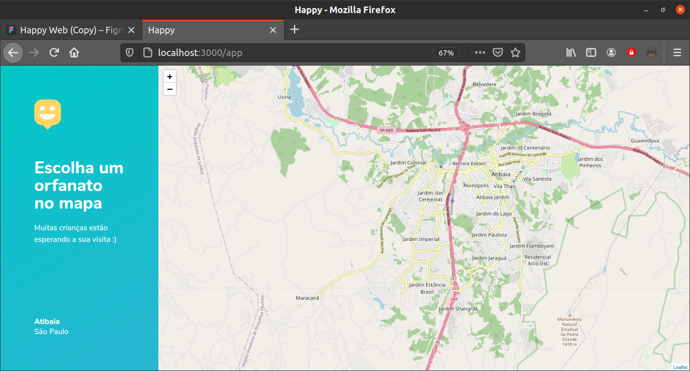
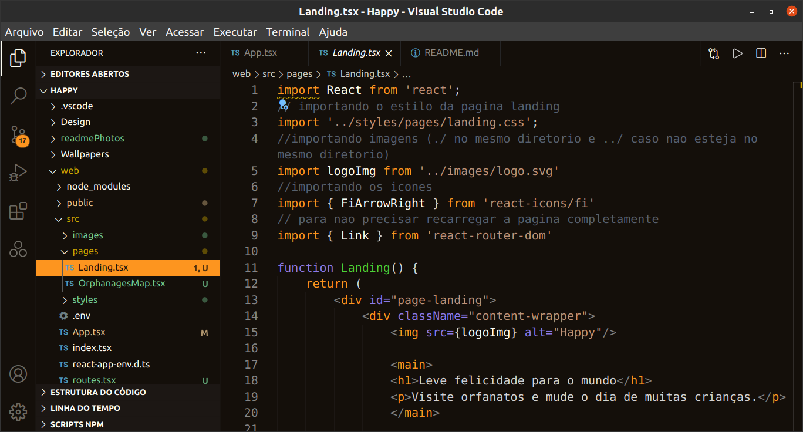
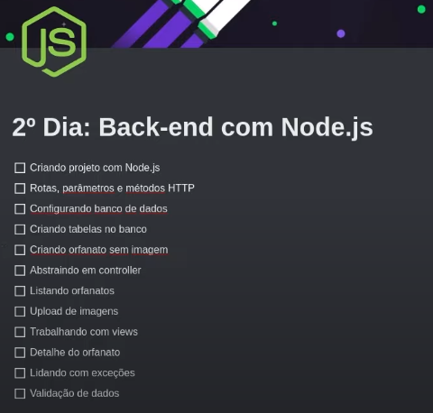

# Happy
 Leve felicidade para o mundo! Unindo pessoas e orfanatos!

## Este aplicativo está sendo desenvolvido a partir da Next Level Week.
### Abaixo terão meus aprendizados nesta semana (12/10/2020 à 18/10/2020).

# Primeros passos
- Create react app - Facebook.
    > yarn create react-app web --template typescript
- Rodar o projeto.
    > yarn start

# Dia 1 - 12/10/2020

## Para o primeiro dia nos foi apresentado o projeto e os primeiros conhecimentos em REACT, adicionando os conceitos de SPA (Single Page Aplication).
## Isso sem contar Typescript!! Vimos quais as melhoras que ele apresenta no JavaScript.
### Desenvolvemos 2 telas e conhecemos as seguintes tecnologias e técnicas:

- [Babel](https://babeljs.io/)
Essa tecnologia faz a tradução do javascript para o navegador.
- [Whimsical](https://whimsical.com/)
Uma ótima ferramenta de design.
- [LeafLet](https://leafletjs.com/)
Mapas para sua aplicação? Veja aqui!
- [Open Street Map](https://www.openstreetmap.org/)
Mais mapas!
- [MapBox](https://www.mapbox.com/)
Outro mapa haha!

### Aprendemos também sobre o sistema de rotas, pois uma SPA é incrível para reduzir o consumo dos recursos ao carregar a aplicação.

# Os pontos foram:

# Segue telas que foram criadas:

## Tela inicial:

## Tela do mapa:

## O que está por trás:

#### E não se engane, tive dificuldades e demorei horas para poder realizar essas ações, porém sei que consegui aprender, e isso é o que importa!

# Dia 2 - 13/10/2020

## O segundo dia foi repleto de desafios, trabalhamos o backe-end completo construindo uma API, a qual receberá e retornará dados independente de qual plataforma estivermos usando (mobile, web), e algumas tecnologias que usamos foram:

- [Insomnia](https://insomnia.rest/)
Aplicativo para fazer o design, debug e testes de nossa API.
- [Postman](https://www.postman.com/)
Ferramenta parecida com a acima, para ter como segunda opção.
- [Beekeeper Studio](https://www.beekeeperstudio.io/)
Editor SQL open Source e gerenciador de banco de dados
- [Yup](https://github.com/jquense/yup)
Para validação de dados
- [Express](https://expressjs.com/)
Usamos bastante este framework também! Pois apresenta utilidades em protocolo HTTP.
- [Type ORM](https://typeorm.io/#/)
Um ORM para rodar NODE.js
e claro:
- [Node JS](https://nodejs.org/en/)
Afinal nao poderíamos rodar nada sem ele!
- [SQLite 3](https://sqlite.org/index.html)
Banco de dados que carrega diretamente na aplicação.

# Os pontos foram:

# Como toda a parte é um back-end, vou adicionar fotos dos programas Insomnia e BeekeeperStudio fazendo os testes da API e seu banco de dados